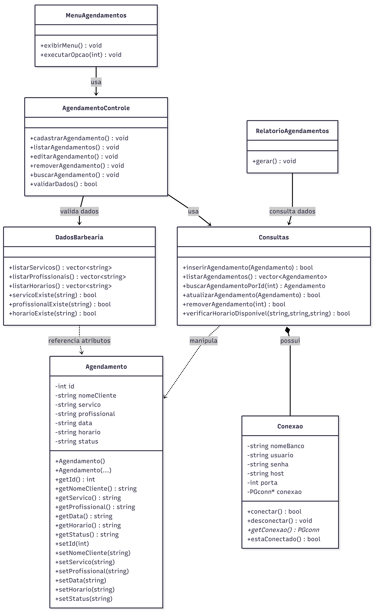

# 💈 Barber Appointment

Sistema de **gerenciamento de agendamentos para barbearia**, desenvolvido em **C++** com persistência de dados em **PostgreSQL**.
O projeto permite registrar, consultar e gerenciar horários de atendimento por meio de uma interface de **linha de comando (CLI)**.

Este projeto foi desenvolvido com foco em **programação orientada a objetos, integração com banco de dados e organização modular em C++**.

---

# 📌 Funcionalidades

* 📅 Criar novos agendamentos
* 📋 Listar agendamentos registrados
* ❌ Cancelar agendamentos
* ⚠️ Prevenção de conflitos de horário para o mesmo barbeiro
* 📊 Geração de relatórios de atendimentos
* 💾 Persistência de dados utilizando **PostgreSQL**
* 🔄 Execução alternativa **sem banco de dados** (modo offline)

---

# 🛠 Tecnologias Utilizadas

* **C++**
* **PostgreSQL**
* **libpq (PostgreSQL C API)**
* **Programação Orientada a Objetos**
* **Arquitetura modular (.h / .cpp)**

---

# 📂 Estrutura do Projeto

```
Barber-Appointment
│
├── include/                     # Arquivos de cabeçalho
│   ├── Agendamento.h
│   ├── AgendamentoControle.h
│   ├── Conexao.h
│   ├── Consultas.h
│   ├── DadosBarbearia.h
│   ├── MenuAgendamentos.h
│   └── RelatorioAgendamentos.h
│
├── src/                         # Implementações
│   ├── Agendamento.cpp
│   ├── AgendamentoControle.cpp
│   ├── Conexao.cpp
│   ├── Consultas.cpp
│   ├── MenuAgendamentos.cpp
│   ├── RelatorioAgendamentos.cpp
│   └── main.cpp
│
├── barbearia_jp.sql             # Script de criação do banco de dados
├── config_exemplo.txt           # Exemplo de configuração da conexão
└── README.md
```

---

# 🗄 Banco de Dados

O sistema utiliza **PostgreSQL** para armazenar os agendamentos.

### Modelo Relacional


Execute o script SQL:

```sql
barbearia_jp.sql
```

O script irá:

* Criar o banco `barbearia_jp`
* Criar a tabela `agendamentos`
* Criar índices de otimização
* Criar restrições para garantir integridade dos dados

### Restrição de Conflito de Horário

```sql
UNIQUE (dia, horario, barbeiro)
```

Isso garante que **um barbeiro não possa ter dois atendimentos no mesmo horário**.

---

# ⚙️ Configuração

Crie um arquivo chamado:

```
config.txt
```

Baseado no arquivo de exemplo:

```
barbearia_jp
postgres
senha
localhost
5432
```

A ordem das informações deve ser:

```
database
user
password
host
port
```

---

# 🚀 Compilação

Utilizamos o MSYS2 para baixar o PostgreSQL, a partir do comando:

```bash
pacman -S mingw-w64-ucrt-x86_64-postgresql
```

Para compilar o projeto utilizando **g++**:

```bash
g++ src/*.cpp -Iinclude -lpq -o barbearia
```

Outra opção é criar um arquivo tasks.json para facilitar a compilação e execução do VsCode

Exemplo:

```
{
    "version": "2.0.0",
    "tasks": [
        {
            "label": "Compilar",
            "type": "shell",
            "command": "g++",
            "args": [
                "-std=c++17",
                "-I./include",
                "-IC:/msys64/ucrt64/include",
                "-LC:/msys64/ucrt64/lib",
                "src/*.cpp",
                "-lpq",
                "-lws2_32",
                "-lsecur32",
                "-ladvapi32",
                "-lcrypt32",
                "-lintl",
                "-liconv",
                "-static-libgcc",
                "-static-libstdc++",
                "-o",
                "build/barbearia.exe"
            ],
            "group": {
                "kind": "build",
                "isDefault": true
            },
            "problemMatcher": ["$gcc"]
        }
    ]
}
```


Certifique-se de que a biblioteca **libpq** esteja instalada no sistema.

---

# ▶️ Execução

Execute o programa:

```bash
./barbearia
```

Mensagem inicial esperada:

```
Bem-vindo ao Sistema de Agendamentos da Barbearia JP!
Conectando ao banco de dados PostgreSQL...
```

Caso a conexão com o banco falhe, o sistema pode operar em **modo sem persistência**, permitindo continuar utilizando as funcionalidades básicas.

---

# 📊 Exemplo de Uso

Menu principal do sistema:

```
1 - Inserir agendamento
2 - Alterar agendamento
3 - Pesquisar por nome
4 - Remover agendamento
5 - Listar todos
6 - Exibir um agendamento
7 - Gerar relatorio
0 - Sair
```
---

# 🧠 Conceitos Aplicados

Este projeto explora diversos conceitos importantes de desenvolvimento:

* Programação orientada a objetos em **C++**
* Separação de responsabilidades entre módulos
* Integração com banco de dados relacional
* Persistência de dados

---

# 👨‍💻 Autor

* Pedro Henrique Araujo de Carvalho
* João Vitor Henrique Duarte

Projeto desenvolvido para fins acadêmicos e de aprendizado nas áreas de:

* Banco de Dados 
* Desenvolvimento em **C++**
* Integração com banco de dados
* Sistemas CRUD
